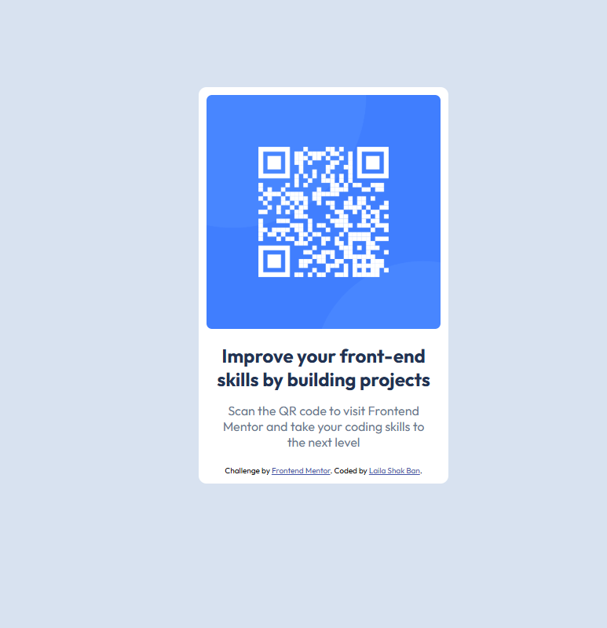

# Frontend Mentor - QR code component solution

This is a solution to the [QR code component challenge on Frontend Mentor](https://www.frontendmentor.io/challenges/qr-code-component-iux_sIO_H). Frontend Mentor challenges help you improve your coding skills by building realistic projects. 

## Table of contents

- [Overview](#overview)
  - [Screenshot](#screenshot)
  - [Links](#links)
- [My process](#my-process)
  - [Built with](#built-with)
  - [What I learned](#what-i-learned)
  - [Continued development](#continued-development)
  - [Useful resources](#useful-resources)
- [Author](#author)
- [Acknowledgments](#acknowledgments)

## Overview

### Screenshot



### Links

- Solution URL: (https://github.com/LailaShakBan7/QR-Code-Challenge-FM)
- Live Site URL:  (https://lailashakban7.github.io/QR-Code-Challenge-FM/)

## My process

### Built with

- Semantic HTML5 markup
- CSS custom properties


### What I learned

It was my first attempt in coding and it was tricky to choose the right properties in css to get the body and the .card to work and be seen as the original display.

At the end, I think I have a done a good job and I am open to feedbacks/comments.

```html

.container {
    margin: 0 auto;
    max-width: 350px;
}

.card {
    background-color: hsl(0, 0%, 100%);
    padding: 10px;
    border-radius: 10px;
    text-align: center;
    margin: 0 1rem;
}
```
### Continued development

I will definitely keep practicing and trying new challenges to improve my skills.

### Useful resources

I watched a few videos on Youtube that most definitely helped me along in this challenge.

https://www.youtube.com/watch?v=-XQlr727A8w

https://www.youtube.com/watch?v=Z1Fm7mSYF7c


## Author

- Frontend Mentor - [@LailaShakBan7](https://www.frontendmentor.io/profile/LailaShakBan7)
